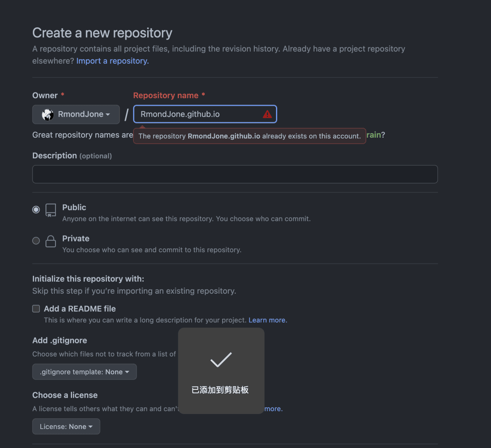
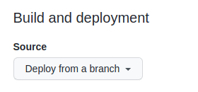
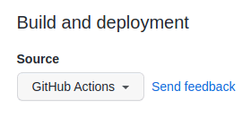
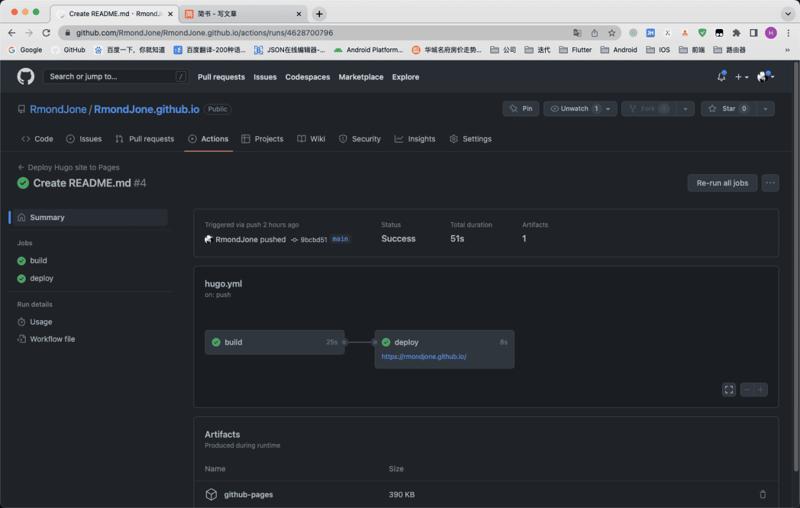

# 一、前言介绍
[Hugo](https://gohugo.io/)是一个个人博客静态框架，相比于Hexo更加轻量生成更加快速。结合GitHub.io可以快速的搭建生成属于自己的博客，并且有丰富的主题和插件支持。

# 二、搭建过程

这里主要阐述Mac上搭建的过程，Window的过程基本类似，唯一的不同就是Hugo本地环境的搭建。这个官网基本都有教程可以自己去官网查看。

### 1、Hugo本地环境的搭建
使用brew命令直接按照官网最新的Hugo版本
```
brew install hugo
```
运行以下命令，有版本输出则本地环境搭建完毕
```
hugo version

guohanlin@guohanlindeMacBook-Pro RmondJone.github.io % hugo version
hugo v0.89.4+extended darwin/amd64 BuildDate=unknown
```

### 2、GitHub创建io仓库并使用Hugo Action

**创建IO仓库**
必须按照以下格式创建：**<userName>.github.io**，userName就是你的GitHub名称




**创建Hugo Action**
访问你刚刚创建的仓库 Settings > Pages. 你将会看到以下选项：

切换至GitHub Action:

有默认的Hugo模板，选中启用即可,会自动生成以下文件。如果你没有看到，也可以手动创建。

`.github/workflows/hugo.yaml`
```
# Sample workflow for building and deploying a Hugo site to GitHub Pages
name: Deploy Hugo site to Pages

on:
  # Runs on pushes targeting the default branch
  push:
    branches:
      - main

  # Allows you to run this workflow manually from the Actions tab
  workflow_dispatch:

# Sets permissions of the GITHUB_TOKEN to allow deployment to GitHub Pages
permissions:
  contents: read
  pages: write
  id-token: write

# Allow only one concurrent deployment, skipping runs queued between the run in-progress and latest queued.
# However, do NOT cancel in-progress runs as we want to allow these production deployments to complete.
concurrency:
  group: "pages"
  cancel-in-progress: false

# Default to bash
defaults:
  run:
    shell: bash

jobs:
  # Build job
  build:
    runs-on: ubuntu-latest
    env:
      HUGO_VERSION: 0.111.3
    steps:
      - name: Install Hugo CLI
        run: |
          wget -O ${{ runner.temp }}/hugo.deb https://github.com/gohugoio/hugo/releases/download/v${HUGO_VERSION}/hugo_extended_${HUGO_VERSION}_linux-amd64.deb \
          && sudo dpkg -i ${{ runner.temp }}/hugo.deb          
      - name: Install Dart Sass Embedded
        run: sudo snap install dart-sass-embedded
      - name: Checkout
        uses: actions/checkout@v3
        with:
          submodules: recursive
          fetch-depth: 0
      - name: Setup Pages
        id: pages
        uses: actions/configure-pages@v3
      - name: Install Node.js dependencies
        run: "[[ -f package-lock.json || -f npm-shrinkwrap.json ]] && npm ci || true"
      - name: Build with Hugo
        env:
          # For maximum backward compatibility with Hugo modules
          HUGO_ENVIRONMENT: production
          HUGO_ENV: production
        run: |
          hugo \
            --gc \
            --minify \
            --baseURL "${{ steps.pages.outputs.base_url }}/"          
      - name: Upload artifact
        uses: actions/upload-pages-artifact@v1
        with:
          path: ./public

  # Deployment job
  deploy:
    environment:
      name: github-pages
      url: ${{ steps.deployment.outputs.page_url }}
    runs-on: ubuntu-latest
    needs: build
    steps:
      - name: Deploy to GitHub Pages
        id: deployment
        uses: actions/deploy-pages@v2
```

### 3、拉去Git仓库本地Hugo调试

**创建默认站点**
进入到Git工程目录，执行以下命令
```
hugo new site .
```
执行完命令之后会生成以下目录结构:
```
.
├── archetypes
│   └── default.md
├── assets
├── config.toml
├── content
├── data
├── layouts
├── public
├── static
└── themes
```

**设置想要的主题**
Hugo的主题有很多，可以去[官网的主题](https://themes.gohugo.io/)目录挑选合适的主题。我这里使用的主题是hugo-papermod,以这个主题为例。首先进入themes目录，然后git clone下来。

```
cd themes

git clone git@github.com:adityatelange/hugo-PaperMod.git
```
然后在config.yaml里`theme: 'hugo-PaperMod'`配置默认主题即可。config.toml我使用不习惯，所以这里我直接改成的yaml写法，直接更改后缀即可，这里直接展示我的yaml配置。
```
#基础配置
baseURL: 'http://rmondjone.github.io'
languageCode: 'zh-CN'
title: '郭翰林的博客'
theme: 'hugo-PaperMod'
enableInlineShortcodes: true
enableRobotsTXT: true
buildDrafts: false
buildFuture: false
buildExpired: false
enableEmoji: true

#配置菜单
menu:
  main:
    - name: 🔍 搜索
      url: search/
      weight: 10
    - name: 分类
      url: tags/
      weight: 10
    - name: 关于我
      url: about/
      weight: 10
    - name: 首页
      url: /
      weight: 10

#主题配置参数
params:
  defaultTheme: auto
  homeInfoParams:
    Title: "技能树"
    Content: >
      XXXXXXXXXX你要显示内容
  socialIcons:
    - name: Github
      url: "https://github.com/RmondJone"
    - name: Email
      url: about/

```
**生成文章**
生成文章主要就是使用`hugo new xxxx.md`这个命令去生成文章即可，执行完命令之后，会自动生成md文件在content目录。如果使用`hugo new  post/xxx.md `，则会在content目录下多生成一个post目录。以此类推。

**关于Markdown的图片引用**
markdown中使用图片引用，需要在static目录下新建一个images文件夹，当然目录名称随便你取，我这里只是举个例子。然后把图片放到images文件夹里。在markdown里像如下写法引用：
```

```

**本地调试**
直接使用命令`hugo server -D`即可，执行完命令之后，会有以下输出，直接点击链接预览即可。
```
guohanlin@guohanlindePro RmondJone.github.io % hugo server
Start building sites … 
hugo v0.111.3+extended darwin/amd64 BuildDate=unknown

                   | EN  
-------------------+-----
  Pages            | 17  
  Paginator pages  |  0  
  Non-page files   |  0  
  Static files     |  1  
  Processed images |  0  
  Aliases          |  4  
  Sitemaps         |  1  
  Cleaned          |  0  

Built in 30 ms
Watching for changes in /Users/guohanlin/Documents/GitHub/RmondJone.github.io/{archetypes,content,static,themes}
Watching for config changes in /Users/guohanlin/Documents/GitHub/RmondJone.github.io/config.yaml
Environment: "development"
Serving pages from memory
Running in Fast Render Mode. For full rebuilds on change: hugo server --disableFastRender
Web Server is available at http://localhost:1313/ (bind address 127.0.0.1)
Press Ctrl+C to stop

```

**远程部署**
本地调试如果没有问题，直接使用命令`hugo -D`生成静态文件即可。然后提交到git上，如果本地不执行命令也没有关系，前面配置的git action会帮你自动执行一遍。然后通过`https://<userName>.github.io`即可访问你的博客




